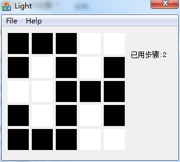

# LightsOut
A mini game Lights Out based on MFC (c++ on windows)  

# Rule    
* Click on the black or white squares to switch the lights (and adjacent lights)  
* Turn off all lights (to black) to win  

# Executable  
[Light.exe](bin/Light.exe)

# Screenshot  

